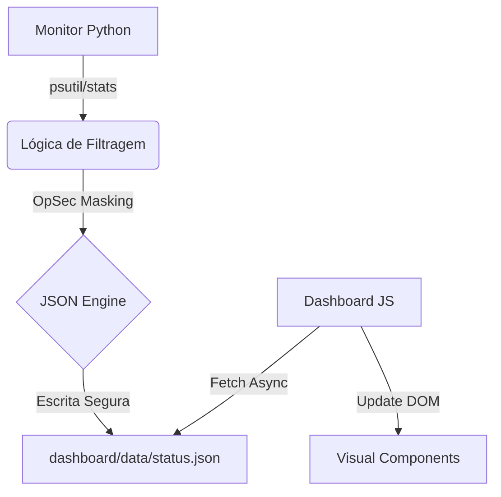

# Especificação de Arquitetura - Missão #002

## 1. Fluxo de Dados (Mermaid)



## 2. Estrutura do Script de Backend
- **Local:** `scripts/monitor_system.py`
- **Dependências:** `psutil`, `json`, `time`
- **Métricas:**
    - `system_status`: Active/Busy
    - `cpu_usage`: Percentual
    - `ram_usage`: Percentual
    - `tor_status`: Boolean (check port 9050)
    - `active_agents`: Contagem baseada em logs recentes em `_opensquad/logs/`

## 3. Contrato do JSON (Preview)
```json
{
  "timestamp": "2026-04-21T23:20:00Z",
  "system": {
    "status": "online",
    "cpu": 15.4,
    "ram": 22.1,
    "tor": true
  },
  "squad": {
    "active_agents": 19,
    "last_mission": "#002"
  }
}
```

## 4. Segurança (OpSec)
- O script NÃO deve incluir nomes de arquivos, caminhos de sistema ou PII no JSON.
- A escrita do arquivo deve ser atômica para evitar corrupção durante o fetch do frontend.

---
> **Audit Note:** Arquiteto finalizou a planta. Chamando o **TDD** para definir os testes de aceitação.
