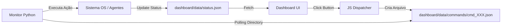

# Arquitetura do Cockpit Interativo - Missão #003

## 1. Loop de Comando (Command Loop)

## 2. Novos Componentes da UI
- **Control Panel:** Uma nova `card` no sidebar com botões:
    - `[X] EMERGENCY STOP`
    - `[↻] REFRESH AGENTS`
    - `[🔐] LOCK SQUAD`
- **Agent Modal/Detail:** Ao clicar num card de agente, abrir um overlay com:
    - Role detalhado.
    - Link para o prompt file.
    - Status de saúde específico.

## 3. Segurança (OpSec Control)
- Comandos recebidos via JSON devem ser sanitizados.
- Apenas comandos pré-definidos na lista branca (Whitelist) serão executados pelo script Python.

## 4. Integração de Skills
- **Skill:** `system_control` - Módulo de integração para bridge entre Web e OS.

---
> **Audit Note:** Arquitetura pronta. **TDD**, defina os contratos de interatividade.
