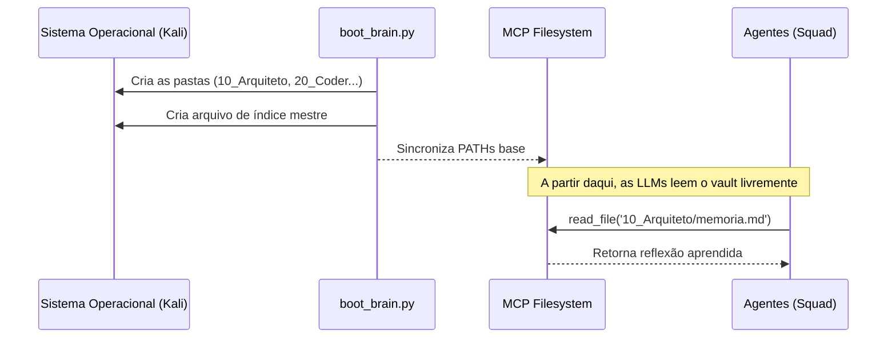

# Documento de Arquitetura e Configuração MCP

## 1. Topologia da Solução (Por Arquiteto 📐)
A otimização exigida pelo Agente Cliente (One-Click Boot) nos obriga a criar o **Bootstrapper Python (`boot_brain.py`)**. Ele será um script pragmático que fará três coisas na velocidade da luz:
1. Verifica e monta as pastas dentro do diretório absoluto do Obsidian na máquina Kali (`/home/kali/Documents/Agencia_Vault`).
2. Toca os arquivos de *Ponto de Identidade* iniciais caso eles não existam (ex: `00_Index.md`).
3. Avisa ao ambiente que está pronto para receber/enviar requisições pelo MCP.

### Diagrama de Fluxo (Boot e Operação)


## 2. Modelagem do Obsidian Frontmatter (Regra de Negócio)
Para que o Obsidian não vire uma bagunça, todo `.md` gerado pela equipe deverá seguir RIGOROSAMENTE esse Schema YAML (Pydantic fará o enforcing no código futuramente):

```yaml
---
agente: "[nome_do_agente]"
data_atualizacao: "2026-04-21"
tags:
  - memoria
  - acerto_tecnico
tipo: "reflexao" | "hand-off" | "erro_contornado"
relevancia: alta | media | baixa
---
```

## 3. Configuração do MCP (Por Integrador MCP 🤖)
Na IDE e no sistema do OpenSquad, o Servidor Filesystem MCP é o pão com manteiga dessa operação. O Obsidian já está na máquina Kali, então só precisamos amarrar o servidor a esse caminho exato.

**Como o arquivo de configuração do MCP (ex: `mcp.json` na raiz da IDE) deve ficar:**
```json
{
  "mcpServers": {
    "obsidian_brain": {
      "command": "npx",
      "args": [
        "-y",
        "@modelcontextprotocol/server-filesystem",
        "/home/kali/Documents/Agencia_Vault"
      ]
    }
  }
}
```

O servidor `@modelcontextprotocol/server-filesystem` libera as rotas automáticas de `read_file`, `write_file` e `search` exclusivamente dentro da pasta do Vault. Isso impede que os agentes alterem partições do sistema e os foca em interagir 100% com as notas puras.

## 4. Status de Aprovação
✅ O Arquiteto selou o modelo.
✅ O Integrador MCP desenhou o JSON de liberação.
⏳ Aguardando o **Desenvolvedor TDD** escrever os cenários de comportamento e então passar para o **Coder Hacker** construir o Python de subida.
