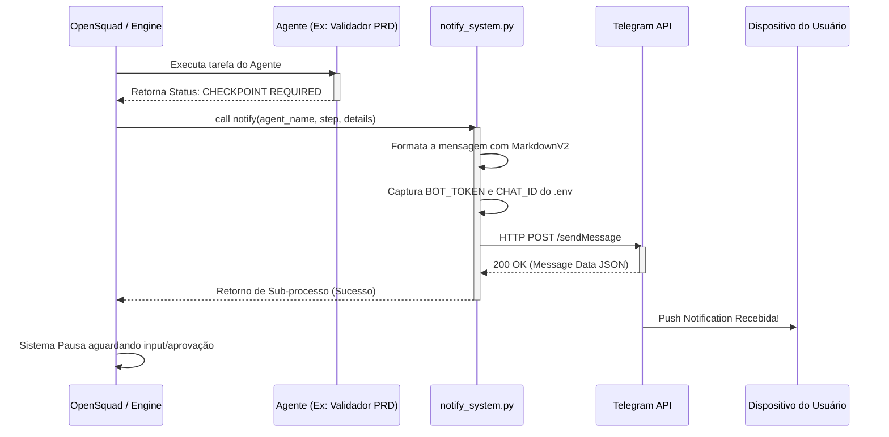

# Arquitetura e Modelagem - Notificador Telegram (Checkpoint)

## 1. Visão Arquitetural (Arquiteto)
O objetivo do sistema é atuar como uma camada de webhook/API de notificação para a esteira do OpenSquad. Quando um checkpoint é alcançado e requer aprovação humana, a engine subjacente invocará nosso módulo `notify_system.py`, o qual fará uma requisição segura e assíncrona para a API Oficial do Telegram, enviando a mensagem descritiva para o dispositivo do usuário.

## 2. Diagrama de Fluxo (Mermaid)


## 3. Integração (Schema do Payload Telegram)
O script Python deve construir o seguinte Payload (JSON) no Post para a URL:
`https://api.telegram.org/bot<TOKEN>/sendMessage`

```json
{
  "chat_id": 6092306332,
  "text": "🚨 *Agencia Squad - Checkpoint*\n\n*Agente:* Validador PRD\n*Ação:* Aguardando revisão humana do arquivo spec.md.\n*Status:* Parado.",
  "parse_mode": "MarkdownV2"
}
```

## 4. Estruturação do Código Base (Blueprint Python)

O arquivo principal será `notify_system.py` contendo uma classe orientada a objetos (ou uma função pura modular) chamada `TelegramNotifier`, que aceitará os seguintes parâmetros:
- `agent_name` (string)
- `step` (string)
- `details` (string)

**Dependências externas da linguagem:**
- Biblioteca padrão `urllib.request` ou `requests` para requisição HTTP externa. (A favor de menos dependências de pacotes, podemos usar a biblioteca nativa, mas o padrão será sugerido via `requests` caso seja aprovado). Vamos assumir o uso de `requests` via `pip`.

---
*Status: Aguardando Agente TDD para a elaboração do esquema de testes comportamentais.*
